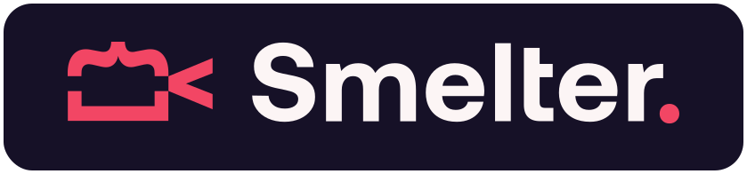

<picture>
  <source media="(prefers-color-scheme: dark)" srcset="assets/smelter-logo-transparent.svg">
  <source media="(prefers-color-scheme: light)" srcset="assets/smelter-logo-background.svg">
  
</picture>

 

**[Documentation](https://smelter.dev/docs)** | **[Discord](https://discord.gg/Cxj3rzTTag)**

 

Smelter is a toolkit for real-time, low-latency, programmable video and audio composition.

With Smelter, you can:
- Combine multimedia from different sources into a single video or live stream
- Enrich your content with text, custom shaders, and embedded websites
- Do it all effortlessly with ready-to-use React components

 

  <image width="840" src="https://github.com/user-attachments/assets/892c1de4-57ca-4858-9f7d-a040aaf0e695"></image>

## Where to start?

Check out our [Getting Started](https://smelter.dev/docs) section, or jump right into [the set of guides](https://www.smelter.dev/ts-sdk/guides/quick-start/) we've prepared.

## Looking for `vk-video`?

Our open-source hardware video coding library, `vk-video` is located in the [`vk-video`](https://github.com/software-mansion/smelter/tree/master/vk-video) subfolder of this repository.

## Smelter is created by Software Mansion

Since 2012, [Software Mansion](https://swmansion.com) is a software agency with experience in building web and mobile apps as well as complex multimedia solutions. We are Core React Native Contributors and experts in live streaming and broadcasting technologies. We can help you build your next dream product – [Hire us](https://swmansion.com/contact/projects?utm_source=smelter&utm_medium=readme).
